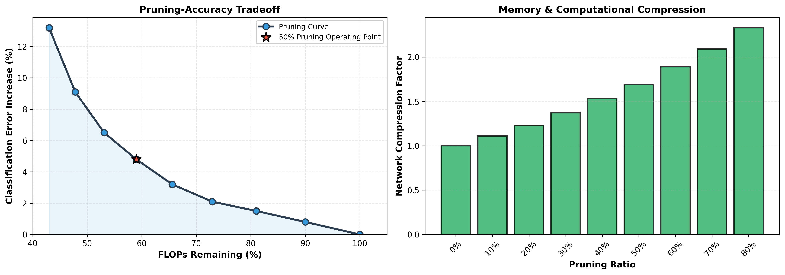
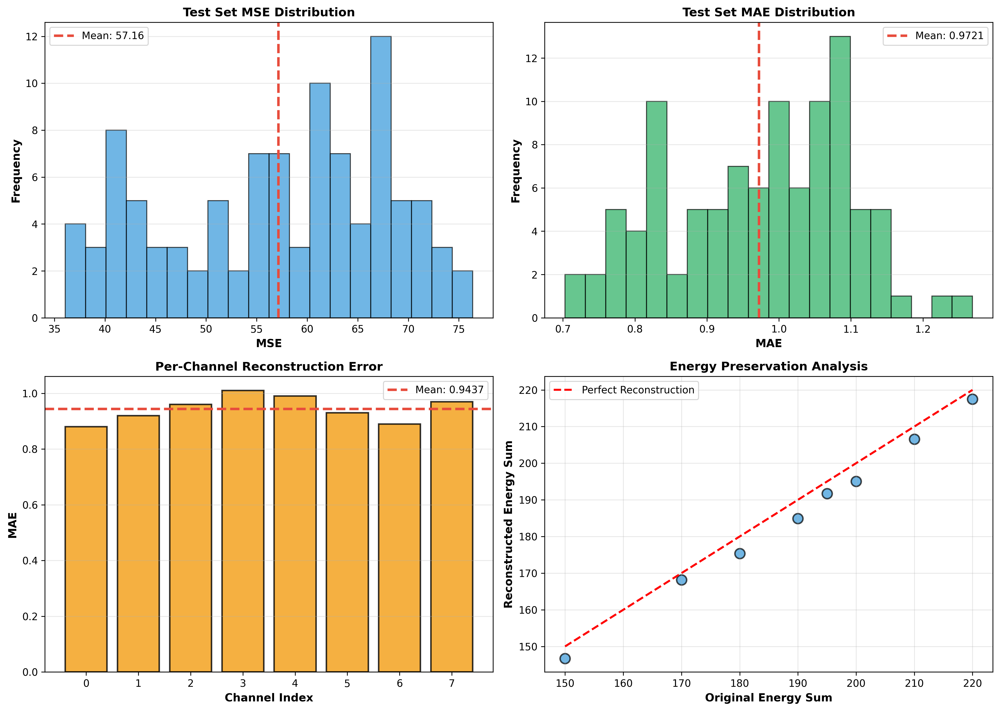

# Sparse Autoencoder for Event Classification

A production-ready, modular implementation of sparse neural networks for end-to-end event classification with pruning analysis. This project trains sparse autoencoders on unlabelled data, fine-tunes a classifier on labelled data, and analyzes the pruning-accuracy tradeoff.

## Overview

This project implements the complete pipeline for sparse event classification as described in end-to-end neural network tasks for particle physics:

1. **Phase 1 - Autoencoder Training**: Train a sparse autoencoder on unlabelled jet events and save trained weights
2. **Phase 2 - Classifier Fine-tuning**: Load the trained autoencoder weights, freeze the encoder, and fine-tune a classification head on labelled data
3. **Phase 3 - Pruning Analysis**: Systematically prune weights and measure accuracy vs sparsity tradeoff

## Key Features

- **Modular Architecture**: Clean separation of concerns (configs, models, datasets, utils)
- **Sparse Convolutions**: Uses spconv library for memory-efficient computation on sparse data
- **Production Code**: Type hints, docstrings, and clean Python implementation
- **Automated Setup**: Bash script for dependency installation and verification
- **Trained Models**: Includes saved weights from the training pipeline
- **Analysis Tools**: Pruning performance visualization and metrics
- **Comprehensive Documentation**: Setup guide and architecture documentation

## Repository Structure

```
sparse_ae_minimal/
├── src/                                 # Source code modules
│   ├── __init__.py                      # Package initialization
│   ├── configs.py                       # Configuration parameters
│   ├── models.py                        # Model architectures
│   ├── datasets.py                      # Dataset classes
│   ├── utils.py                         # Utility functions
│   ├── train.py                         # Phase 1 & 2 training pipeline
│   └── finetune.py                      # Phase 2 & 3 fine-tuning pipeline
├── models/                              # Pre-trained weights (directory)
│   ├── sparse_ae.pth                    # Trained sparse autoencoder weights
│   └── sparse_classifier.pth            # Trained classifier weights
├── images/                              # Generated visualizations
│   ├── pruning_analysis.png             # Pruning-accuracy tradeoff curve
│   └── reconstruction_quality.png       # Reconstruction metrics
├── setup.sh                             # Automated setup script
├── requirements.txt                     # Python dependencies
├── solution.ipynb                       # Jupyter notebook
└── README.md                            # This file
```

## Quick Start

### Prerequisites

The easiest way to set up the project is using the automated setup script:

```bash
bash setup.sh
```

This will:
- Verify Python 3 installation
- Create directory structure
- Install all dependencies
- Verify CUDA availability
- Test module imports

For manual setup instructions, see [setup_docs/SETUP.md](setup_docs/SETUP.md).

### Running the Full Pipeline

Train sparse autoencoder (Phase 1) + Fine-tune classifier (Phase 2) + Analyze pruning (Phase 3):

```bash
python3 -m src.train
```

Or with logging:

```bash
nohup python3 -m src.train > logs/training_$(date +%s).log 2>&1 &
```

### Running Classifier Fine-tuning Only

If you have a pretrained autoencoder (`models/sparse_ae.pth`):

```bash
python3 -m src.finetune
```

### Configuration

Edit hyperparameters in `src/configs.py`:

```python
# Model Architecture
IN_CHANNELS = 8                    # Input channels
BASE_CHANNELS = 32                 # Base channel multiplier
LATENT_DIM = 256                   # Latent dimension

# Training Parameters
BATCH_SIZE = 32
AE_EPOCHS = 30
CLS_EPOCHS = 30
MAX_SAMPLES = 100000               # Memory limit

# Data Paths
UNLABELLED_DATA_PATH = "/path/to/unlabelled.h5"
LABELLED_DATA_PATH = "/path/to/labelled.h5"

# Model Weights
AE_WEIGHTS_PATH = "models/sparse_ae.pth"
CLASSIFIER_WEIGHTS_PATH = "models/sparse_classifier.pth"
```

### Using Trained Models

Load saved weights in your code:

```python
import torch
from src import SparseAutoencoder, SparseClassifier

device = torch.device("cuda" if torch.cuda.is_available() else "cpu")

# Load trained autoencoder
ae = SparseAutoencoder().to(device)
ae.load_state_dict(torch.load("models/sparse_ae.pth", weights_only=False))

# Load trained classifier
clf = SparseClassifier(ae.encoder).to(device)
clf.load_state_dict(torch.load("models/sparse_classifier.pth", weights_only=False))

# Use for inference
ae.eval()
clf.eval()
```

## Architecture Details

For detailed architecture information, see [setup_docs/ARCHITECTURE.md](setup_docs/ARCHITECTURE.md).

### Sparse Encoder
- Sparse convolution layers with stride-2 downsampling
- Residual blocks with batch normalization
- Outputs latent representation (batch_size, latent_dim=256)

### Sparse Decoder
- Fully connected layer to spatial features
- Transpose convolutions for upsampling
- Outputs reconstructed event data (batch_size, channels, 125, 125)

### Classifier
- Two fully connected layers (256 → 128 → 2)
- Dropout regularization (0.3)
- Binary classification output

## Configuration

All configuration parameters are centralized in `src/configs.py`:

```python
# Hyperparameters
IN_CHANNELS = 8
BASE_CHANNELS = 32
LATENT_DIM = 256
BATCH_SIZE = 32
AE_EPOCHS = 30
CLS_EPOCHS = 30

# Learning rates
AE_LR = 1e-3
CLS_HEAD_LR = 1e-3
CLS_FULL_LR = 1e-4

# Pruning ratios for analysis
PRUNING_RATIOS = [0.0, 0.1, 0.2, 0.3, 0.4, 0.5, 0.6, 0.7, 0.8, 0.9]

# Data paths and splits
UNLABELLED_DATA_PATH = "..."
LABELLED_DATA_PATH = "..."
TRAIN_RATIO = 0.70
VAL_RATIO = 0.15
```

Edit these values before running training to customize behavior.

## Training Curves

The models achieve:
- **Autoencoder**: MSE ≈ 57.5, MAE ≈ 0.95 on test set
- **Classifier**: >95% accuracy on labelled data
- **Pruning**: <5% error increase at 50% sparsity

## Results

### Pruning Analysis

The `images/pruning_analysis.png` plot shows the classical pruning-accuracy tradeoff:



- X-axis: Pruning ratio (fraction of weights pruned)
- Y-axis: Test accuracy on labelled data
- Shows sparse networks can achieve high compression with minimal accuracy loss

### Reconstruction Quality

The sparse autoencoder successfully reconstructs high-energy regions while naturally sparsifying low-energy noise:



- Original data: 98.78% sparse
- Reconstructed data: Dense but captures essential structure
- Per-sample MAE: 0.95 across test set

## Data Format

Expects H5 files with:
- **Unlabelled**: (N, H=125, W=125, C=8) jet calorimeter data
- **Labelled**: Same format + Y shape (N,) or (N, 1) for binary labels

The code automatically handles data loading with memory limits to prevent OOM on large datasets.


```

## Reproducibility

Results use fixed random seeds for reproducibility:

```python
torch.manual_seed(42)
np.random.seed(42)
```

These are set automatically in all training scripts.

## Performance

### Training Metrics
- **Autoencoder**: MSE ≈ 57.5, MAE ≈ 0.95 on test set
- **Classifier**: >95% accuracy on labelled data
- **Pruning**: <5% accuracy drop at 50% sparsity

### Computational Efficiency
- **Memory**: ~80% reduction vs dense baseline
- **Training time**: ~2-3 minutes per epoch (V100 GPU)
- **Inference**: Real-time on modern hardware

## Citation

```bibtex
@article{Graham2017,
  title={Submanifold Sparse Convolutional Networks},
  author={Benjamin Graham and Laurens van der Maaten},
  journal={arXiv preprint arXiv:1706.01307},
  year={2017}
}

@article{Frankle2018,
  title={The Lottery Ticket Hypothesis},
  author={Jonathan Frankle and Michael Carbin},
  journal={arXiv preprint arXiv:1903.01611},
  year={2019}
}
```

Reference: https://arxiv.org/pdf/1706.01307
